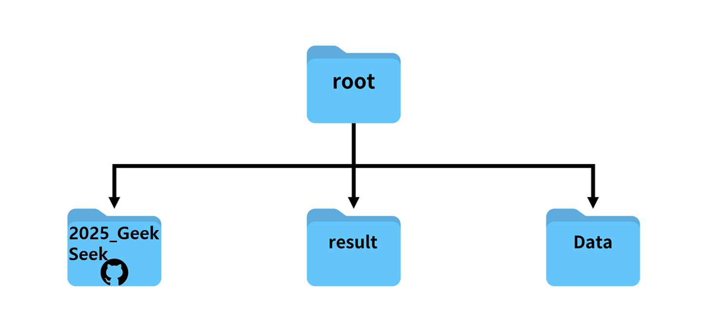
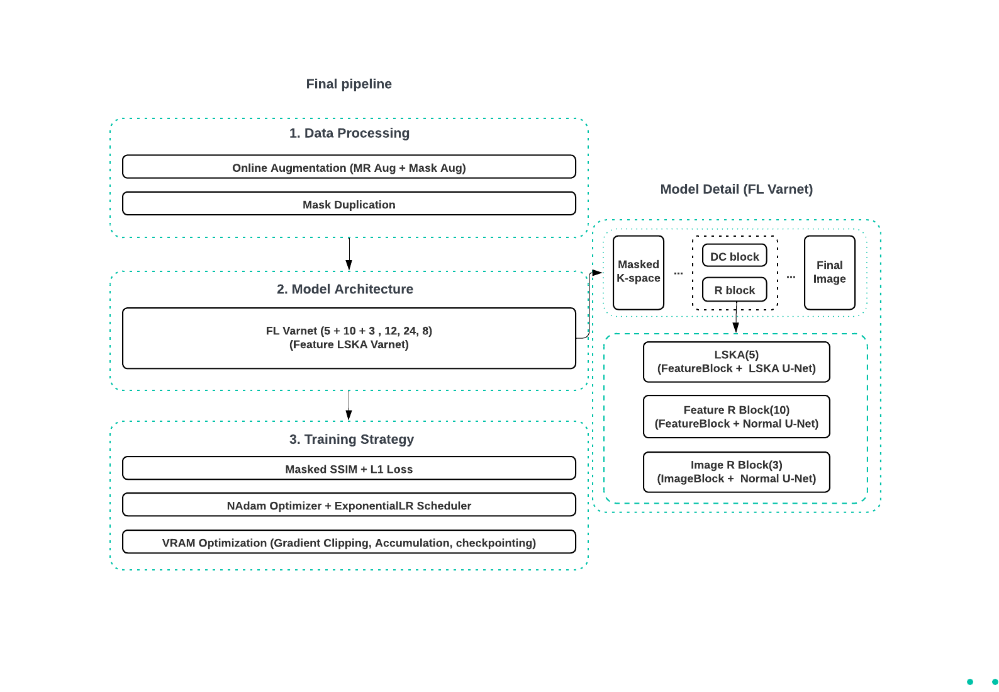

# 2025 baby varnet
2025 SNU FastMRI challenge

## 1. 폴더 계층

### 폴더의 전체 구조

* `2025_GeekSeek`, `Data`, `result` 폴더가 위의 구조대로 설정되어 있어야 default argument를 활용할 수 있습니다.
* 본 project repository는 `2025_GeekSeek` 폴더입니다.
* `Data` 폴더는 MRI data 파일을 담고 있으며 아래에 상세 구조를 첨부하겠습니다.
* `result` 폴더는 학습한 모델의 weights을 기록하고 validation, leaderboard dataset의 reconstruction image를 저장하는데 활용되며, 아래에 상세 구조를 첨부하겠습니다.

### Data 폴더의 구조

### result 폴더의 구조 (최종 모델과 loss_log 파일 위치)
* 최종 모델의 weight과 train_loss_log.npy의 위치는 다음과 같습니다.
  * weight	 : /root/result/FLvarnet_SOTA_ver2/checkpoints/best_model.pt
  * train_loss: /root/result/FLvarnet_SOTA_ver2/train_loss_log.npy

## 2. Before you start
* ```final_main.py```, ```reconstruct_from_ckpt.py```, ```leaderboard_eval.py``` 순으로 코드를 실행하면 됩니다.
* ```final_main.py```
   * train을 진행하고 학습한 model의 결과를 result 폴더에 저장합니다.
   * 가장 성능이 좋은 모델의 weights을 ```best_model.pt```으로 저장합니다. 
* ```reconstruct_from_ckpt.py```
   * ```final_main.py```으로 학습한 ```best_model.pt```을 활용해 leader_board dataset을 reconstruction하고 그 결과를 result 폴더에 저장합니다.
   * sh 파일을 통해서 recon할 model의 파일위치와 leaderboard 파일의 폴더 위치를 지정해야합니다.
* ```leaderboard_eval.py```
   * ```reconstruct_from_ckpt.py```을 활용해 생성한 reconstruction의 SSIM을 측정합니다.
   * SSIM (acc4): acc4 데이터에 대한 reconstruction의 SSIM을 측정합니다.
   * SSIM (acc8): acc8 데이터에 대한 reconstruction의 SSIM을 측정합니다.
   * Total SSIM은 SSIM (acc4), SSIM (acc8)의 평균으로 계산됩니다. Report할 때 이 값을 제출하시면 됩니다.

## 3. How to set?
(vessl 기본 환경)
```bash
cd 2025_GeekSeek
pip install -r requirements.txt
```
  * 다른 gpu환경에선 이 명령어만으로 충분하지만, vessl 환경에는 cv2관련 라이브러리 문제가 발생합니다. 
  * 이를 위해 다음의 명령어도 같이 입력해주시길 바랍니다.
```bash
pip uninstall -y opencv-python opencv-contrib-python opencv-python-headless
pip install opencv-python-headless
```

## 4. How to train?
```bash
python3 final_main.py --config-name=train_vessl_final
```
- wandb를 사용하여 파일 실행시 wandb 관련 설정이 나옵니다.
  - wandb를 사용하시려면 나오는 안내에 따라 wandb 계정의 api값을 입력하시면 됩니다.
  - wandb를 사용하시지 않는다면 사용하지 않는다고 설정하고 학습 돌리면 됩니다.
- 최종 제출 모델의 checkpoint는 **31epoch** 지난 후의 모델이니 확인 부탁드립니다!

## 5. How to reconstruct?
```bash
sh reconstruct_from_ckpt.sh
```
- leaderboard 평가를 위한 reconstruction data를 ```result/reconstructions_leaderboard```에 저장합니다.

```bash
# reconstruct_from_ckpt.sh 내부 구조

python3 reconstruct_from_ckpt.py \
  -c '/root/result/FLvarnet_SOTA_ver2/checkpoints/best_model.pt' \
  -p '/root/Data/leaderboard/' \
  -g '0' \
  -b '1'
```
- shell 파일의 내부는 위와 같습니다.
  - vessl 서버에서 정상적으로 작동하는것을 확인하였지만, 혹여나 recon 관련 문제가 생기는 경우 -c, -p 매개변수를 수정해 best_model.pt 파일의 경로를 올바르게 수정하거나 -p를 수정하여 leaderboard 데이터의 위치를 수정해주세요.
  -  -g는 사용하는 gpu num을 의미하고, -b는 recon시 데이터의 batch를 의미합니다. 이 값도 필요에 따라 조정해주세요.  

## 6. How to evaluate LeaderBoard Dataset?
```bash
sh leaderboard_eval.sh
```
- leaderboard 순위 경쟁을 위한 4X sampling mask, 8X sampling mask에 대한 SSIM 값을 한번에 구합니다.
- Total SSIM을 제출합니다.

```bash
# leaderboard_eval.sh 내부 구조

python leaderboard_eval.py \
  -lp '/root/Data/leaderboard/' \
  -yp '../result/FLvarnet_SOTA_ver2/reconstructions_leaderboard'
```
- 아래 shell코드의 내부는 위와 같습니다.

## 7. 학습 초반 loss 분석
- 2번 동일한 학습을 vessl 서버에서 진행하여 학습 loss log를 간단하게 분석해보았습니다.
- 두번의 실험 결과는 다음과 같습니다.

```bash
[0, 0.05174956009908141],
 [1, 0.03992757683711755],
 [2, 0.03911593152924132],
 [3, 0.037159226735768255],
 [4, 0.03613388958366072],
 [5, 0.03636509514238606],
 [6, 0.03507799722612755],
 [7, 0.034516697370667974],
 [8, 0.03420444333113083],
 [9, 0.033618167470363586],
 [10, 0.03338674137597978],
 [11, 0.032902077121699284],
 [12, 0.03269830090918017],
 [13, 0.03239366806683124],
 [14, 0.03200947608718263],
 [15, 0.032041795397460125],
 [16, 0.0316363511226526]
```

```bash
[0, 0.05174956009908141],
 [1, 0.03992757683711755],
 [2, 0.03911593152924132],
 [3, 0.037159226735768255],
 [4, 0.03613388958366072],
 [5, 0.03636509514238606],
 [6, 0.03507799722612755],
 [7, 0.034516697370667974],
 [8, 0.03410775480858317],
 [9, 0.03362301465519774],
 [10, 0.033362152432333224],
 [11, 0.0329151575020824],
 [12, 0.03265756879886114],
 [13, 0.032373722377555765],
 [14, 0.032002973107187443],
 [15, 0.03202888956039449],
 [16, 0.031581964705320625]
```
- loss 값이 달라지는 시점은 7epoch에서 발생했습니다.
- loss값의 변동폭은 0.001 이하의 값으로 나타나는 것을 확인하였습니다.
  - 자세한 변동 폭은 위의 log를 참조해주시면 감사하겠습니다.

## 8. 간단한 모델 설명

* 본 모델은 **Feature VarNet 아키텍처**를 기반으로, 여러 개의 블록을 직렬로 연결한 **캐스케이드(Cascade) 구조**를 가집니다.
* `configs/model/dlka_varnet.yaml` 설정 파일에 따라 `cascade_counts: [5, 10, 3]`로 구성되며, 총 18개의 블록을 순차적으로 통과하며 점진적으로 이미지를 복원합니다.
* 각 단계의 역할은 다음과 같습니다.
    * **1단계 (LSKA-UNet Feature Cascade, 5개 블록)**
        * LSKA (Large Seperable Kernel Attention)가 적용된 U-Net을 사용하여 Feature image의 전체적인 맥락과 넓은 영역의 특징을 먼저 학습합니다.
    * **2단계 (Standard-UNet Feature Cascade, 10개 블록)**
        * 표준 U-Net을 통해 Feature image의 국소적인 디테일과 세밀한 질감을 정교하게 다듬습니다.
    * **3단계 (Image Cascade, 3개 블록)**
        * 표준 U-Net을 통해 일반 Image의 국소적인 디테일과 세밀한 질감을 정교하게 다듬습니다.
